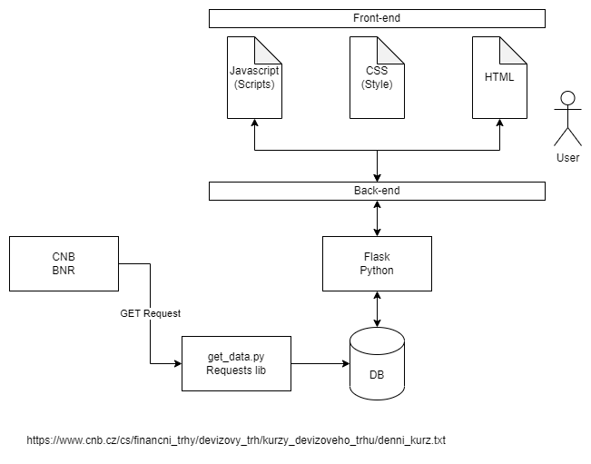

## Exchange Rate Calculator
Use case to learn app development with Pytohn.

Steps:

1. Download and parse data from CNB daily exchange rates using Python Requests (https://www.cnb.cz/cs/financni_trhy/devizovy_trh/kurzy_devizoveho_trhu/denni_kurz.txt)
    - How to use requests guide: https://requests.readthedocs.io/en/latest/user/quickstart/

2. Store the data in a DB (sqlite should be enough)

3. Build a Flask app to expose the database and the static web files (html, css, javascript)

4. Build the front-end. Simple html, css and maybe javascript to communicate with the back-end.

